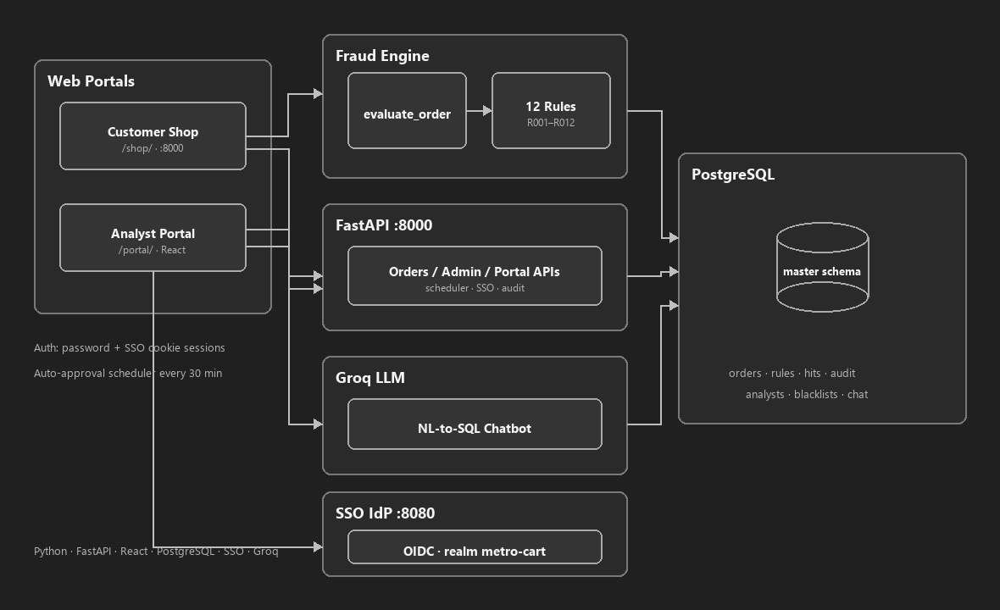

# Metro Cart — E-Commerce Fraud Detection & Analytics Platform

Real-time, rule-based fraud detection for e-commerce orders. The platform evaluates every purchase against configurable rules, automates hold / review / reject decisions, supports analyst investigation, and exposes analytics through FastAPI, web portals, Power BI, and an AI chatbot.

---

# Overview

When a customer places an order, the fraud engine applies rules from `master.rule_master` and can:

- Approve the order
- Hold the order (`ON_HOLD`)
- Send the order for manual review (`PENDING_REVIEW`)
- Reject the order

Held and review orders wait for `rule_master.delay_minutes` from rules whose action is **HOLD** or **REVIEW**. After that window they become **backlog** and can be handled by analysts or **auto-approved** by the API scheduler on timeout (**every 30 minutes**).

Included surfaces:

- Customer purchase shop (`/shop/`)
- Fraud Analyst Workspace (`/portal/`)
- Admin Control Panel (users, permissions, rules, blacklists, analytics)
- RBAC page permissions
- AI analytics chatbot (Groq)
- Power BI dashboards
- English / Thai UI language toggle
- bcrypt-hashed passwords
- Role-based PII masking (Admin sees full data; analysts see masked email, phone, address, and IP)

Architecture overview:



Regenerate with:

```powershell
.\.venv\Scripts\python.exe scripts\generate_architecture_diagram.py
```

---

# Features

## Real-time fraud detection

- Configurable static, velocity, behavioral, and linkage rules
- Review timeout driven by `delay_minutes` (R001 default **180**; others typically **60**)
- Max delay across triggered **HOLD / REVIEW** rules for multi-hit orders (`PASS` / `REJECTED` delays are ignored)
- Background auto-approval of expired holds/reviews every **30 minutes**

## Analyst portal

- Pending review / hold queue and backlog management
- Individual and bulk approve / reject / flag fraud
- Remaining-time timers and overdue highlighting
- Admin, Power BI, and AI chatbot pages (RBAC-gated)
- PII masking for non-Admin roles in queue, order detail, and blacklist actions
- Session restore from HttpOnly cookie via `/auth/me` (local password + SSO)
- Scheduler timestamps shown in **IST** in the Admin analytics UI (backend remains UTC)

## Admin panel

- Create analyst accounts (passwords hashed with bcrypt)
- Page permissions and roles
- Rule configuration with action-aware field enable/disable:
  - **R001**: action locked to HOLD; only Delay Minutes editable
  - **Blacklist rules**: action locked to REJECTED; detection params and delay disabled
  - **PASS**: Threshold / Interval / Unit / Delay locked (action editable)
  - **REJECTED**: detection params editable; Delay locked
  - **HOLD / REVIEW**: Delay editable; threshold/interval follow rule type
- IP / email / phone blacklist management (including blacklist-from-order)
- KPI, rule analytics, and auto-approval scheduler status
- System audit log viewer

## AI chatbot

- Natural-language questions over orders, fraud, revenue, customers, products, devices, and rules
- SQL generation + validation (SELECT-only) via Groq
- Charts and follow-up suggestions
- Sensitive fields (`email`, `phone`, `address`, `ip`) masked in tables, charts, history, and logs

## Localization & UX

- UI language: English / Thai (chatbot answers stay in English)
- Currency display: Thai Baht (฿)

---

# Fraud detection rules

| Rule | Description | Typical action |
|------|-------------|----------------|
| P2 iPhone 16 Rule | High-risk product monitoring | Hold |
| Email Velocity | Multiple orders from the same email | Review |
| IP Velocity | Multiple orders from the same IP | Review |
| Device Velocity | Multiple orders from the same device | Review |
| User Spend Velocity | Spending exceeds threshold | Review |
| Multiple Users Same Email | Same email linked to multiple users | Review |
| Blacklisted IP | IP present in blacklist | Reject |
| Burst Orders | Multiple orders within a short duration | Review |
| Address Velocity | Multiple deliveries to the same address | Review |
| Device Switching | Frequent device changes | Review |
| Blacklisted Phone Number | Phone present in blacklist | Reject |
| Blacklisted Email | Email present in blacklist | Reject |

---

# Technology stack

| Component | Technology |
|-----------|------------|
| Backend API | FastAPI (+ lifespan auto-approval scheduler) |
| Database | PostgreSQL 15 (Podman Compose) |
| Analyst UI | Static app in `static/analyst-portal/` (optional React source in `analyst-portal/`) |
| Customer UI | Static web app in `static/customer-portal/` |
| Analytics | Power BI embed |
| AI | Groq API |
| Auth | bcrypt + signed portal session cookies / tokens + optional Keycloak SSO |
| Language | Python 3.10+ |
| Containers | Podman / podman-compose |

---

# Project structure

```text
ECommerce-Fraud_Analysis_Detection/
├── ai/                         # Chatbot engine + Groq client + prompts
├── api/                        # FastAPI routes + scheduler
├── auth/                       # Customer / analyst auth + password hashing + Keycloak SSO helpers
├── keycloak/                   # Keycloak realm import + metro-cart login theme
│   ├── realm-metro-cart.json
│   └── themes/metro-cart/      # Login theme matching analyst portal
├── database/                   # Connection pool + repositories
├── fraud_engine/               # Rules, engine, backlog, auto-approval, audit
├── images/                     # Docs assets
├── init_scripts/ecommerce_fraud/
│   └── schema.sql              # Full DDL + seed (Compose init)
├── analyst-portal/             # Optional React source (publish with -BuildPortal)
├── static/
│   ├── analyst-portal/         # Served analyst UI at /portal/
│   └── customer-portal/        # Customer shop served at /shop/
├── scripts/
│   ├── hash_seed_passwords.py
│   ├── _gen_customer_i18n.py
│   ├── _gen_portal_i18n.py
│   ├── _regen_order_rule_hits_sql.py
│   └── generate_architecture_diagram.py
├── tests/
├── ui/                         # Shared translation catalog (i18n)
├── utils/                      # Queries, PII masking, blacklist helpers
├── config.py
├── podman-compose.yaml
├── requirements.txt
├── start.ps1                   # Start Postgres + FastAPI + portals
├── stop.ps1                    # Stop FastAPI + Postgres
├── .env.example
└── README.md
```

**Runtime:** one FastAPI process serves the API and both static portals. Use only `start.ps1` / `stop.ps1` to manage the platform.

---

# Getting started

## Prerequisites

- Python 3.10+
- Podman (with `podman-compose` available — `pip install podman-compose` if needed)
- Chrome (optional; `start.ps1` opens portals)

## Quick start (Windows)

From the project root in PowerShell:

```powershell
.\start.ps1
```

First run will:

1. Create `.venv` and install `requirements.txt`
2. Create `.env` from `.env.example` if missing
3. Start PostgreSQL + Keycloak via `podman-compose.yaml`
4. Serve the analyst portal from `static/analyst-portal/` (pass `-BuildPortal` only when deliberately publishing the React build)
5. Start FastAPI on `:8000` (API + both portals)
6. Open the service URLs in Chrome

Stop everything:

```powershell
.\stop.ps1
```

### Service URLs

| Service | URL |
|---------|-----|
| API docs | http://127.0.0.1:8000/docs |
| Analyst portal | http://127.0.0.1:8000/portal/ |
| Customer shop | http://127.0.0.1:8000/shop/ |
| Keycloak (SSO) | http://127.0.0.1:8080 (realm `metro-cart`) |

App logs: `.run/logs/`

### Demo logins (seed data)

| Portal | ID / username | Password |
|--------|---------------|----------|
| Customer | `U1001` | `password123` |
| Analyst | `analyst` | `secure123` |
| Admin | `admin` | `admin123` |

Passwords are stored as **bcrypt** hashes.

**Analyst SSO (Keycloak):** use **Sign in with SSO** on the analyst login page with the same usernames/passwords (`admin` / `admin123`, `analyst` / `secure123`). Keycloak admin console uses `KEYCLOAK_ADMIN` / `KEYCLOAK_ADMIN_PASSWORD`.

Keycloak login uses the custom **`metro-cart`** theme (same look as the analyst portal login: portal background, white card, blue accent). Theme files live in `keycloak/themes/metro-cart/` and are mounted into the Keycloak container.

**Password authority model:** local username/password login remains available alongside SSO. Changing an analyst password in the portal updates the local Metro Cart hash and, when Keycloak admin credentials are configured, syncs the matching Keycloak user password. If Keycloak admin credentials are missing, local password change still succeeds (SSO sync is skipped).

## Environment

Copy `.env.example` → `.env` and set at least:

| Variable | Purpose |
|----------|---------|
| `DB_HOST`, `DB_PORT`, `DB_NAME`, `DB_USER`, `DB_PASSWORD` | App DB connection |
| `POSTGRES_*` / same credentials | Compose Postgres |
| `GROQ_API_KEY` | AI chatbot (required for chatbot answers) |
| `API_BASE_URL` | Default `http://127.0.0.1:8000` |
| `CORS_ALLOW_ORIGINS` | Browser origins allowed to call the API |
| `POWER_BI_EMBED_URL` | Optional Power BI embed |
| `PORTAL_SECRET` | Signs analyst portal session cookies / tokens (set a strong random value) |
| `KEYCLOAK_ENABLED` | `true` to show SSO on analyst login (default `true`) |
| `KEYCLOAK_URL` / `KEYCLOAK_REALM` / `KEYCLOAK_CLIENT_*` | OIDC client settings for analyst SSO |
| `KEYCLOAK_REDIRECT_URI` | Must match Keycloak client redirect URI |
| `SSO_DEFAULT_RETURN_TO` | Where browsers land after SSO (default `/portal/`) |
| `KEYCLOAK_ADMIN` / `KEYCLOAK_ADMIN_PASSWORD` | Optional; required only to sync portal password changes into Keycloak |
| `KEYCLOAK_START_MODE` | `start-dev` for laptop demos; use a non-dev mode outside local POCs |
| `SYSTEM_AUDIT_LOG_PATH` | Optional path for JSONL file backup of system audit events |
| `SYSTEM_AUDIT_FILE_BACKUP` | `true` (default) to also append audit events to the JSONL file; DB is source of truth |

## Database initialization

Compose mounts `init_scripts/ecommerce_fraud/` → `/docker-entrypoint-initdb.d`.

Postgres runs `schema.sql` **once** when the data volume is empty.

Rebuild DB from scratch:

```powershell
podman-compose -f podman-compose.yaml down -v
.\start.ps1
```

Optional helper to bcrypt-hash remaining plain-text passwords:

```powershell
.\.venv\Scripts\python.exe scripts\hash_seed_passwords.py
```

## Manual setup (optional)

```powershell
python -m venv .venv
.\.venv\Scripts\activate
pip install -r requirements.txt
Copy-Item .env.example .env   # edit DB_* / GROQ_API_KEY
podman-compose -f podman-compose.yaml up -d
uvicorn api.main:app --reload --host 127.0.0.1 --port 8000
```

### Analyst portal source (dev)

```powershell
cd analyst-portal
npm install
npm run dev
```

Vite proxies API calls to FastAPI on port 8000. FastAPI serves `static/analyst-portal/` in production. To publish a React build into that folder (overwrites assets), run `npm run build` or `.\start.ps1 -BuildPortal`.

### i18n regeneration

After editing `ui/i18n.py`, regenerate portal translation files:

```powershell
.\.venv\Scripts\python.exe scripts\_gen_portal_i18n.py
.\.venv\Scripts\python.exe scripts\_gen_customer_i18n.py
```

## Tests

```powershell
.\.venv\Scripts\python.exe -m pytest -q
```

Integration tests (require live PostgreSQL):

```powershell
.\.venv\Scripts\python.exe -m pytest -m integration -q
```

## pgAdmin (optional)

| Parameter | Value |
|-----------|-------|
| Host | `localhost` |
| Port | `5434` (or `DB_PORT` from `.env`) |
| Database | `DB_NAME` / `POSTGRES_DB` |
| Username | `DB_USER` / `POSTGRES_USER` |
| Password | `DB_PASSWORD` / `POSTGRES_PASSWORD` |

---

# User roles

## Customer

- Browse products and place multi-item orders
- Manage cart and account / password

## Fraud analyst

- Review holds / pending reviews / backlog
- Approve, reject, or flag fraud
- Use AI chatbot and allowed dashboards (per permissions)
- Sees masked customer PII (email, phone, address, IP)

## Administrator

- Manage analysts and page permissions
- Configure rules (action-aware field locking) and delay minutes
- Manage blacklists
- View scheduler status and system audit logs
- Full portal access including unmasked PII

---

# Platform workflow

```text
                 Customer Places Order
                         │
                         ▼
               Real-Time Fraud Engine
                         │
                         ▼
        ┌──────────────────────────────────┐
        │ Approve │ Hold │ Review │ Reject │
        └──────────────────────────────────┘
                         │
                         ▼
         Delay window (HOLD/REVIEW delay_minutes only)
                         │
            ┌────────────┴────────────┐
            ▼                         ▼
     Analyst Workspace         Auto-approval
     (backlog / review)        (every 30 min)
            │
            ▼
     Final status + order_review_audit
```

---

# Security

- RBAC page permissions
- Analyst portal auth uses signed HttpOnly session cookies; boot restores session via `/auth/me` (Bearer header still accepted for API/tests)
- Customer shop APIs require customer Bearer tokens
- `reviewed_by` / `blacklisted_by` / `granted_by` are taken from the authenticated session (not trusted from the client)
- bcrypt password hashing (create user + change password + seed data)
- Legacy plain-text passwords upgraded on successful login when present
- IP / email / phone blacklists (blacklist-from-order uses raw DB values)
- Analyst portal PII masking for non-Admin roles (`utils/pii.py`)
- Chatbot PII masking for email, phone, address, IP (including aliased column names) in UI/charts/logs
- Signed analyst portal session cookies / tokens (`PORTAL_SECRET`)
- Optional Keycloak OIDC SSO for analysts (maps IdP username → `master.analyst_users`; local password login unchanged)
- Password change syncs to Keycloak when admin API credentials are set; otherwise local change still applies
- **System audit in PostgreSQL** (`master.system_audit_log`) for logins, order create/approve/reject, blacklist, permissions, rule updates, and auto-approval — viewable under Admin → Audit Logs (`GET /portal/audit-logs`). Optional JSONL file backup via `SYSTEM_AUDIT_FILE_BACKUP` / `SYSTEM_AUDIT_LOG_PATH`.
- Order review audit (`master.order_review_audit`) and chatbot logs (`master.ai_chat_logs`)
